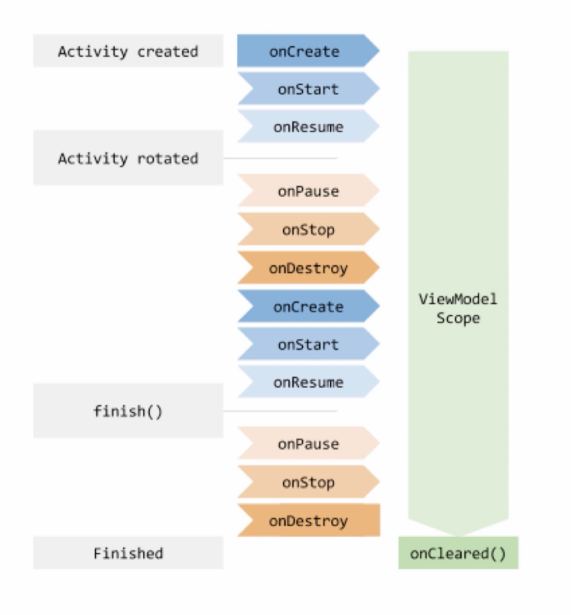
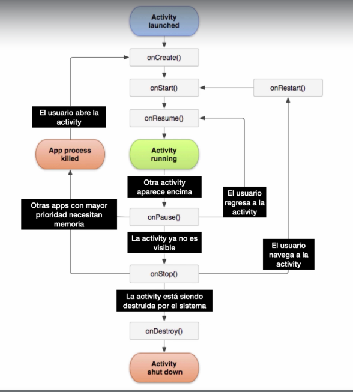

# Index
- [Instalacion](#instalacion)
    + [Configuracion dispositivo](#configuracion-dispositivo)
- [Lenguaje](#lenguaje)
- [Estructura](#estructura)
  * [Manifest](#manifest)
  * [Java](#java)
  * [Res](#res)
    + [drawable](#drawable)
    + [mipmap](#mipmap)
    + [values](#values)
      - [string](#string)
  * [Gradle](#gradle)
    + [Build](#build)
- [Activity](#activity)
  * [Explicit Intent](#explicit-intent)
  * [Implicit Intent](#implicit-intent)
  * [Parcelable](#parcelable)
- [View](#view)
  * [Data Binding](#data-binding)
  * [Scroll](#scroll)
- [ViewModel](#viewmodel)
  * [LiveData](#livedata)
- [Layout](#layout)
    + [Lineal](#lineal)
    + [Frame](#frame)
    + [Relative](#relative)
    + [Contraint](#contraint)
- [Logs](#logs)
  * [Logcat](#logcat)
  * [Log](#log)
- [Mensajes](#mensajes)
  * [Toasts](#toasts)
- [LifeCycle](#lifecycle)

<small><i><a href='http://ecotrust-canada.github.io/markdown-toc/'>Table of contents generated with markdown-toc</a></i></small>

# Instalacion
https://developer.android.com/studio/install?hl=es-419

### Configuracion dispositivo
Primero tenemos que indicarnos como programador de la siguiente manera<br />
*sistema > acerca dispositivo > numero de compilacion*<br />
<br />
Luego configurarlo de la siguiente manera:<br />
*sistema > avanzado > Opciones programador*

- vemos que este activo
- que diga permanecer activo
- Depuracion por USB


# Lenguaje
```kotlin
// decimos que no puede ser null
val extras = intent.extras!!

// si miVariable es null asigno ""
val valor = miVariable ?: ""

// validamoss que puede venir null
val extra = data?.extras

// crear constantes o componentes estaticos
companion object {
    const val HERO_KEY = "hero"
    const val HERO_BITMAP_KEY = "hero_bitmap"
}

// se le debe asignar valor antes de ser usada
private lateinit var miVariable: ImageView


class MainViewModel: ViewModel() {
    private val _localScore = MutableLiveData<Int>()

    // creamos un getter
    val localScore: LiveData<Int>
        get() = _localScore

    private val _visitorScore = MutableLiveData<Int>()

    // creamos un getter
    val visitorScore: LiveData<Int>
        get() = _visitorScore

    // lo primero que se va a ejecutar
    init {
        resetScores()
    }
}
```

```xml
<Button
    // hace la ejecucion de la funcion al momento de darle click
    android:onClick="@{() -> mainViewModel.decreseFunction()}"
    />
```
# Estructura

## Manifest
Podemos configurar ciertas cosas
```xml
<application
        android:allowBackup="true"
        android:icon="@mipmap/ic_launcher" // Icono de la aplicacion
        android:label="@string/app_name" // Nombre de la aplicacion
        android:roundIcon="@mipmap/ic_launcher_round" // Icono redondo
        android:supportsRtl="true"
        android:theme="@style/AppTheme">

        // Aca vamos a tener todas las actividades
        <activity android:name=".MainActivity">
            <intent-filter>
                // Main activiti va a ser la principal
                <action android:name="android.intent.action.MAIN" /> 

                // La primera que se va a lanzar
                <category android:name="android.intent.category.LAUNCHER" />
            </intent-filter>
        </activity>
    </application>
```

## Java
En la carpeta java estara todo nuestro codigo

## Res
Estaran los recursos, por ejemplo pantallas

### drawable
Imagenes y contenido multimedia

### mipmap
POdemos agregar iconos. Tenemos varias resoluciones y uno para cuadrado y otro para redondo.<br />
Damos click der en mipmap > New > Image asset<br />
Seleccionamos la imagen que nosotros queramos

### values
Para generar valores de diferentes idiomas generamos una carpeta **values-es** por ejemplo (para español)

#### string
Vamos a poner todos los textos estaticos de nuestra aplicacion<br />
Con **Alt + Enter** los generamos de una forma facil

```xml
// translatable -> No tiene traduccion
<resources>
    <string name="app_name" translatable="false">Mi edad canina</string>
    <string name="your_age">Your age</string>
</resource>
```

```kotlin
val result = getString(R.string.lalita)
```

## Gradle

### Build

```groovy
apply plugin: 'com.android.application'
apply plugin: 'kotlin-android'
apply plugin: 'kotlin-android-extensions'
apply plugin: 'kotlin-kapt'

android {
    compileSdkVersion 29
    buildToolsVersion "29.0.3"

    defaultConfig {
        applicationId "com.hackaprende.registrodesuperheroes"
        minSdkVersion 21
        targetSdkVersion 29
        versionCode 1
        versionName "1.0"

        testInstrumentationRunner "androidx.test.runner.AndroidJUnitRunner"
    }

    buildTypes {
        release { // lo que va a ir a produccion
            minifyEnabled false
            proguardFiles getDefaultProguardFile('proguard-android-optimize.txt'), 'proguard-rules.pro'
        }
    }

    dataBinding {
        enabled = true
    }
}

dependencies {
    // Dependencias
}
```

# Activity
Por cada actividad tenemos un archivo kotlin y el archivo xml que contiene el diseño de la aplicacion.<br />
La principal es MainActivity<br />

## Explicit Intent
Vamos a usar **Intent** para ir a otra activity, nos permite enviar contenido de una activity a la otra, pero debemos especificar a que activitdad queremos ir

```kotlin
val binding = ActivityMainBinding.inflate(layoutInflater)
setContentView(binding.root)

binding.saveButton.setOnClickListener {
    val hero = Hero("Nombre", "otro campos", "detalle", "estrellita")
    openDetailsActivity(hero)
}

private fun openDetailsActivity(hero: Hero) {
    // Intent(desde aqui, hasta aqui)
    val intent = Intent(this, DetailActivity::class.java)
    // intent.putExtra("campo","valor")
    intent.putExtra(DetailActivity.HERO_KEY, hero)
    intent.putExtra(DetailActivity.HERO_BITMAP_KEY, heroBitmap)
    startActivity(intent)
}

```
**Para recibir los valores**
```kotlin
class DetailActivity : AppCompatActivity() {
    override fun onCreate(savedInstanceState: Bundle?) {
        super.onCreate(savedInstanceState)
        val binding = ActivityDetailBinding.inflate(layoutInflater)
        setContentView(binding.root)

        // obtenemos los valores, con los !! decimos que no puede ser null
        val extras = intent.extras!!
```

## Implicit Intent
Acciones, que aplicaciones pueden abrir ese intent, como la camara
```kotlin
// abrir camara y esperar resultado
val camaraIntent = Intent(MediaStore.ACTION_IMAGE_CAPTURE)
startActivityForResult(camaraIntent, 1000) // numero de request, identificador
```
```kotlin

Se ejecutara luego de haber recibido el resultado
override fun onActivityResult(requestCode: Int, resultCode: Int, data: Intent?) {
        super.onActivityResult(requestCode, resultCode, data)

        if (resultCode == Activity.RESULT_OK && requestCode == 1000) {
            val extras = data?.extras
            heroBitmap = extras?.get("data") as Bitmap
            superheroImage.setImageBitmap(heroBitmap!!)
        }
    }

```
## Parcelable
Nos permite pasar objetos entre las actividades, para poder utilizarlo necesitamos agregar lo siguiente en el archivo **build.gradle**<br />
Convierte los objetos en bytes para poder ser pasados<br />
```groovy
plugins {
    id 'com.android.application'
    id 'kotlin-parcelize'
    // Otros plugins
}
```
El objeto debemos definirlo como parcelize
```kotlin
package com.hackaprende.registrodesuperheroes

import android.os.Parcelable
import kotlinx.android.parcel.Parcelize

@Parcelize
class Hero(val name: String, val alterEgo: String, val bio: String, val power: Float) : Parcelable
```

# View
Todas las cosas que podamos ver en la pantalla son View. Como por ejemplo imagenes, texto, botones, etc..<br />
Tenemos atributos como color, tamaño, etc..
```xml
<ImageView
    android:layout_width="match_parent"   // Todo lo que abarca el padre
    android:layout_height="wrap_content"
    android:src="@drawable/dog_meme"
    android:adjustViewBounds="true"  // Quitamos espacios en blanco
    android:text="Hello World!" />

<TextView
    android:layout_width="match_parent"  // Todo lo que abarca el padre
    android:layout_height="wrap_content"
    android:padding="16dp"
    android:textColor="@android:color/black"
    android:textSize="18sp"
    android:text="@string/instructions" />

<EditText
    android:id="@+id/age_edit" // con los IDS vamos a poder usar esto en el codigo
    android:layout_width="match_parent"  // Todo lo que abarca el padre
    android:layout_height="wrap_content" // Solo lo que contiene
    android:layout_marginStart="16dp"
    android:layout_marginEnd="16dp"
    android:inputType="number" // el tipo de dato que recibe
    android:gravity="center" // alinear el texto
    android:hint="@string/your_age" // texto q se muestra como ayuda
    tools:text="La puta madre" // Solo lo vamos a ver en el preview, no en la app
/>
```

```kotlin
val ageEdit = findViewById<EditText>(R.id.age_edit)

val resultText = findViewById<TextView>(R.id.result_text)
resultText.text = "Lala"

val button = findViewById<Button>(R.id.button)
button.setOnClickListener {
    // cuando demos click al boton se ejecutara esto
}
```

**Relative Layout**<br />
```xml
<ImageView
    android:id="@+id/superhero_image" />

<EditText
    android:id="@+id/superhero_name_edit"
    android:layout_alignTop="@id/superhero_image" //toma como referencia el id superhero_image
    android:layout_marginStart="16dp"
    android:layout_toEndOf="@id/superhero_image"
    android:hint="@string/superhero_name" />

<Button
    android:id="@+id/save_button"
    android:layout_alignParentBottom="true" // poner abajo de la pantalla
     />

```
## Data Binding
Utilizar **findViewById** no es permormante porque es pesado, lo mejor es utilizar **binding**<br /><br />

Vamos a **build.gradle** y despues damos click en **sync**
```groovy
apply plugin: 'kotlin-kapt'

android {
    ...
    dataBinding {
        enabled = true
    }

    // O podriamos usar tambien 
    buildFeatures {
        dataBinding true
    }
}
```
En el layout damos click en **Convert to data binding layout<br />
```xml
<layout>
    <data>
        // variables que podemos usar directamente en el layout
        <variable
            name="superhero"
            type="com.lala.pija.Superhero"
        />
    </data>

    // todo mi layout (LiearLayout)

        <TextView
            android:text="@{superhero.name}"
        />
</layout>
```
```kotlin
val binding = ActivityMainBinding.inflate(layoutInflater)
setContentView(binding.root)

val ageEdit = binding.ageEdit
```

## Scroll
POder agregar scroll a los views, los **ScrollView** solo pueden tener 1 hijo

```xml

<Button
    android:id="@+id/save_button"
    android:text="@string/save" />

 <ScrollView
            android:layout_width="match_parent"
            android:layout_height="wrap_content"
            android:layout_alignParentTop="true"
            android:layout_above="@id/save_button"> // esta arriba del boton

            <RelativeLayout
                android:layout_width="match_parent"
                android:layout_height="wrap_content"
                android:orientation="vertical">
                ...
             </RelativeLayout>
 </ScrollView

```

# ViewModel
Nos sirve para seguir teniendo los datos en el ciclo de vida, aca estara toda la logica.<br />
Por ejemplo, vamos a poder seguir teniendo los datos al girar el telefono<br />
<br />
Debemos agregar la dependencia
```groovy
dependencies {
    ...
    implementation "androidx.lifecycle:lifecycle-viewmodel-ktx:2.2.0"
    ...
}
```
**MainActivity**

```kotlin
class MainActivity : AppCompatActivity() {
    private lateinit var binding: ActivityMainBinding
    private lateinit var viewModel: MainViewModel

    override fun onCreate(savedInstanceState: Bundle?) {
        super.onCreate(savedInstanceState)
        binding = ActivityMainBinding.inflate(layoutInflater)
        setContentView(binding.root)

        // creacion del viewmodel
        viewModel = ViewModelProvider(this).get(MainViewModel::class.java)

    }

    private fun resetScores() {
        viewModel.resetScores()
    }
}
```
**MainViewModel**
```kotlin
// Todos los datos y valores los vamos a tener aca
// Jamas debemos pasar nada que pueda referenciar al activity

// hereda de ViewModel
class MainViewModel: ViewModel() {
    private var miVar = 0

    fun resetScore(){
        miVar = 0
    }
}
```

## LiveData
Para que el ViewModel sea conciente del ciclo de vida<br />
Son variables que contienen otras variables

- LiveData Normal: Solo leer valores
- LiveData Mutable: Asignarlos y leerlos

```kotlin
class MainViewModel: ViewModel() {
    val localScore: MutableLiveData<Int> = MutableLiveData()
    val visitorScore: MutableLiveData<Int> = MutableLiveData()

    // Se ejecuta al inicio de ejecutarse el ViewModel
    init {
        resetScores()
    }

    fun resetScores() {
        localScore.value = 0
        visitorScore.value = 0
    }
}
```

```kotlin
class MainActivity : AppCompatActivity() {

    override fun onCreate(savedInstanceState: Bundle?) {
        ...

        viewModel.localScore.observe(this, Observer {
            // un observador
            // cuando localScore cambie va a llamar directamente a esto

            binding.localScoreText.text = localStoreValue.toString()
        })

    }

}
```

# RecyclerView
IMplementacion de listas, recicla las listas y las vuelve a utilizar, por ejemplo las listas que no se ven en el scroll
```groovy
dependencies {
    ...
    implementation 'androidx.recyclerview:recyclerview:1.1.0'
    ...
}
```

```xml
<androidx.recyclerview.widget.RecyclerView
    android:id="@+id/eq_recycler"
    android:layout_width="match_parent"
    android:layout_height="wrap_content" />
```
Cada **RecyclerView** va a tener este contenido
```xml
<?xml version="1.0" encoding="utf-8"?>
<layout xmlns:android="http://schemas.android.com/apk/res/android"
    xmlns:tools="http://schemas.android.com/tools">

    <data>

    </data>

    // Usa RelativeLayout porque tenia problemas con el LinearLayout
    <RelativeLayout
        android:layout_width="match_parent"
        android:layout_height="wrap_content"
        android:gravity="center_vertical"
        android:padding="16dp">
        ...
    </RelativeLayout>
</layout>
```
## Asignacion
Para asignar los valores al recyclerView lo vamos a hacer mediante un **Adapter**<br/>
Todos los adapters deben tener **onCreateViewHolder** y **onBindViewHolder**<br />

```kotlin
// ListAdapter recibe el objeto (en este caso terremoto)
// y el ViewHolder que nos va a ayudar a reciclar nuestras listas
class EqAdapter(val context: Context) : ListAdapter<Earthquake, EqAdapter.ViewHolder>(
    DiffCallback
) {

    // Que item cambio, cual se agrego, etc..
    companion object DiffCallback : DiffUtil.ItemCallback<Earthquake>() {
        override fun areItemsTheSame(oldItem: Earthquake, newItem: Earthquake): Boolean {
            // si tienen el mismo ID son el mismo
            return oldItem === newItem
        }

        override fun areContentsTheSame(oldItem: Earthquake, newItem: Earthquake): Boolean {
            // Compara contenido de los 2 elementos
            return oldItem.id == newItem.id
        }
    }

    private lateinit var onItemClickListener: ((earthquake: Earthquake) -> Unit)

    fun setOnItemClickListener(onItemClickListener: (earthquake: Earthquake) -> Unit) {
        this.onItemClickListener = onItemClickListener
    }

    // EqListItemBinding es para manejar las listas de binding
    override fun onCreateViewHolder(parent: ViewGroup, viewType: Int): ViewHolder {
        val binding = EqListItemBinding.inflate(LayoutInflater.from(parent.context))
        return ViewHolder(binding)
    }

    override fun onBindViewHolder(holder: ViewHolder, position: Int) {
        // lo recibimos en la posicion correspondiente que recibimos
        val earthquake = getItem(position)
        holder.bind(earthquake) // cargamos los datos
    }

    // el ViewHolder recibe el View 
    inner class ViewHolder(private val binding: EqListItemBinding):
        RecyclerView.ViewHolder(binding.root) {
        // acrgamos los datos del terremoto
        fun bind(earthquake: Earthquake) {
            binding.eqListItemMagnitude.text = context.getString(R.string.magnitude_format,
                earthquake.magnitude)
            binding.eqListItemTitle.text = earthquake.place

            binding.root.setOnClickListener {
                if (::onItemClickListener.isInitialized) {
                    onItemClickListener(earthquake)
                }
            }
        }
    }
}
```

```kotlin
class MainActivity : AppCompatActivity() {
    override fun onCreate(savedInstanceState: Bundle?) {
        super.onCreate(savedInstanceState)
        val binding = ActivityMainBinding.inflate(layoutInflater)
        setContentView(binding.root)

        val viewModel = ViewModelProvider(this,
            MainViewModelFactory(application)).get(MainViewModel::class.java)

        val recyclerView = binding.eqRecycler
        recyclerView.layoutManager = LinearLayoutManager(this)

        val adapter = EqAdapter(this)
        recyclerView.adapter = adapter

        adapter.setOnItemClickListener {
            openDetailActivity(it)
        }

        viewModel.eqListLiveData.observe(this, Observer {
            adapter.submitList(it)
            if (it.size == 0) {
                recyclerView.visibility = View.GONE
                binding.eqEmptyView.visibility = View.VISIBLE
            } else {
                recyclerView.visibility = View.VISIBLE
                binding.eqEmptyView.visibility = View.GONE
            }
        })

        viewModel.statusLiveData.observe(this, Observer {
            if (it == ApiResponseStatus.LOADING) {
                binding.loadingWheel.visibility = View.VISIBLE
            } else {
                binding.loadingWheel.visibility = View.GONE
            }

            if (it == ApiResponseStatus.NO_INTERNET_CONNECTION) {
                Toast.makeText(this, R.string.no_internet_connection,
                    Toast.LENGTH_SHORT).show()
            }
        })
    }

    private fun openDetailActivity(earthquake: Earthquake) {
        val intent = Intent(this, EqDetailActivity::class.java)
        intent.putExtra(EqDetailActivity.EQ_KEY, earthquake)
        startActivity(intent)
    }
}
```
## LinearLayout Manager
Uno abajo del otro, como whatsapp. Listas horizontales o verticales

## GridLayout Manager
En grillas, x2, x3, etc..

## Staggered GridLayout Manager
En grillas pero como tetris, de diferentes tamaños y posiciones, como printerest

# Layout
Para elegir lo mejor es elegir la opcion en la cual tengas menos Views Layout<br />


### Lineal
Los pone uno al lado del otro, de manera vertical u horizontal

```xml
<LinearLayout
    android:layout_width="match_parent"
    android:layout_height="match_parent"
    android:orientation="vertical"
    tools:context=".MainActivity">

...

</LinearLayout>
```

### Frame
Diseñado para mostrar un view a la vez, imagen, video, boton, ect..<br />
Solo una a la vez, los view se traslapan entre ellos cuando se generan

### Relative
Acomodamos los View de la manera que queramos, en la parte de abajo, en el centro, etc..

### Contraint
Todo se hace en la parte del diseño, muy versatil pero se usa para pocos Views<br />


# Logs

## Logcat
Para ver los errores lo podemos ver en la pestaña de abajo de **Logcat** seleccionando **error**

## Log
Podemos hacer logs nuestros, podemos definirle el nivel de log

```kotlin
// recibe un tag y un mensaje
Log.d("MainActivity", "Mi actividad")
```
Existen 5 niveles diferentes:
- verbose: imprimir cualquier cosa
- debug: imprimir cualquier cosa 
- info: algo se pone un poco peligroso
- warm: algo se pone mas peligroso
- error: ya puede ocurrir un error grave
- assert: 

```kotlin
Log.v("MainActivity", "Mi verbose")
Log.d("MainActivity", "Mi debug")
Log.i("MainActivity", "Mi info")
Log.w("MainActivity", "Mi warm")
Log.e("MainActivity", "Mi error")
```

# Mensajes

## Toasts
Mensaje que aparene en la parte inferior de la pantalla, aparece y se va
```kotlin
// contexto -> de donde se esta llamando
// y duracion
Toast.makeText(this, "Mi mensaje", Toast.LENGTH_SHORT).show()
```

# LifeCycle
 <br />

Cuando oprimimos **home** la aplicacion pasa a pause y stop<br />
Cuando volteamos el celular se destrute la seccion

```kotlin
class MainActivity : AppCompatActivity
```